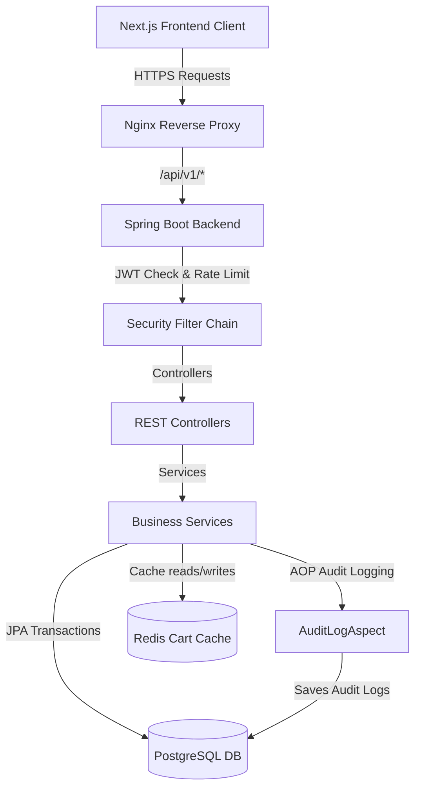

# Tài Liệu Kỹ Thuật Hệ Thống 7Eleven Shop (E-commerce Platform)

Tài liệu này cung cấp hướng dẫn kỹ thuật chi tiết, kiến trúc thiết kế, sơ đồ cơ sở dữ liệu, đặc tả API và quy trình vận hành/bảo trì cho dự án **7Eleven Shop**. Đây là cẩm nang hướng dẫn đầy đủ nhất dành cho nhà phát triển hệ thống (Developers) và kỹ sư vận hành (DevOps/SRE).

---

## 1. Tổng Quan Hệ Thống (System Overview)

### 1.1 Mục Tiêu & Phạm Vi
**7Eleven Shop** là một hệ thống thương mại điện tử (E-commerce) tinh gọn, hiệu năng cao và có khả năng mở rộng. Dự án được triển khai để giải quyết bài toán mua sắm trực tuyến cơ bản và quản lý bán hàng cho chuỗi cửa hàng tiện lợi 7-Eleven.
Hệ thống được thiết kế theo mô hình **Monolithic tách biệt (Decoupled Monolith)**:
- **Backend:** Cung cấp API RESTful phi trạng thái (Stateless), hiệu năng cao, bảo mật bằng JWT.
- **Frontend:** Xây dựng bằng Next.js App Router (React 19) mang lại trải nghiệm người dùng mượt mà, tối ưu hóa SEO và kết xuất phía máy chủ (SSR).

### 1.2 Các Chức Năng Chính
1. **Trang Mua Sắm (Customer Front-end):**
   - Xem và lọc sản phẩm linh hoạt (theo từ khóa, danh mục, khoảng giá).
   - Chi tiết sản phẩm kèm slide ảnh (Carousel), hiển thị số lượng tồn kho thực tế.
   - Quản lý giỏ hàng đồng bộ trực tiếp với bộ nhớ đệm Redis của Server.
   - Thanh toán đơn hàng COD (Thanh toán khi nhận hàng) với các quy định xác thực thông tin người nhận nghiêm ngặt.
   - Bảng điều khiển cá nhân gợi ý sản phẩm bán chạy, xem lịch sử đặt hàng, trạng thái vận chuyển và cho phép hủy đơn hàng ở trạng thái chờ duyệt.
2. **Trang Quản Trị (Admin Dashboard):**
   - Thống kê KPI thời gian thực: Tổng doanh thu, số đơn hàng, tổng sản phẩm và người dùng đăng ký.
   - Biểu đồ xu hướng doanh thu và cơ cấu trạng thái đơn hàng (sử dụng Recharts).
   - CRUD danh mục sản phẩm (chặn xóa nếu danh mục đang chứa sản phẩm).
   - CRUD sản phẩm hỗ trợ upload nhiều ảnh cùng lúc lên dịch vụ Cloudinary CDN.
   - Quản lý và duyệt trạng thái đơn hàng theo máy trạng thái chặt chẽ.
   - Quản lý người dùng: Phân quyền vai trò (USER $\leftrightarrow$ ADMIN) và khóa/mở khóa tài khoản.

---

## 2. Kiến Trúc Cơ Sở Dữ Liệu Chi Tiết (Database Schema)

Hệ thống sử dụng **PostgreSQL 16** làm cơ sở dữ liệu quan hệ chính. Các bảng được liên kết chặt chẽ qua khóa ngoại và được đánh chỉ mục tối ưu. Dưới đây là đặc tả chi tiết của từng bảng:

### 2.1 Bảng `users` (Quản lý tài khoản)
| Tên cột | Kiểu dữ liệu | Ràng buộc | Mô tả |
| :--- | :--- | :--- | :--- |
| `id` | `BIGSERIAL` | `PRIMARY KEY` | Định danh người dùng |
| `email` | `VARCHAR(255)` | `UNIQUE`, `NOT NULL` | Email đăng nhập |
| `password` | `VARCHAR(255)` | `NOT NULL` | Mật khẩu mã hóa BCrypt |
| `full_name` | `VARCHAR(255)` | `NOT NULL` | Họ và tên người dùng |
| `is_active` | `BOOLEAN` | `DEFAULT TRUE` | Trạng thái hoạt động |
| `created_at` | `TIMESTAMP WITH TIME ZONE` | `NOT NULL` | Thời gian tạo tài khoản |
| `updated_at` | `TIMESTAMP WITH TIME ZONE` | `NOT NULL` | Thời gian cập nhật gần nhất |
| `deleted_at` | `TIMESTAMP WITH TIME ZONE` | `NULL` | Thời gian xóa mềm (nếu có) |

- **Chỉ mục (Indexes):**
  - `idx_users_email` (B-Tree trên cột `email`) để tối ưu hóa truy vấn đăng nhập.
  - `idx_users_deleted_at` để lọc tài khoản đang hoạt động.

### 2.2 Bảng `roles` (Quản lý vai trò)
| Tên cột | Kiểu dữ liệu | Ràng buộc | Mô tả |
| :--- | :--- | :--- | :--- |
| `id` | `SERIAL` | `PRIMARY KEY` | Định danh vai trò |
| `name` | `VARCHAR(50)` | `UNIQUE`, `NOT NULL` | Tên vai trò (ví dụ: `USER`, `ADMIN`) |

### 2.3 Bảng `user_roles` (Bảng trung gian N-N)
| Tên cột | Kiểu dữ liệu | Ràng buộc | Mô tả |
| :--- | :--- | :--- | :--- |
| `user_id` | `BIGINT` | `FOREIGN KEY REFERENCES users(id)` | Liên kết tới người dùng |
| `role_id` | `INTEGER` | `FOREIGN KEY REFERENCES roles(id)` | Liên kết tới vai trò |

- **Ràng buộc phụ:** `PRIMARY KEY (user_id, role_id)` để đảm bảo một người dùng không bị gán trùng lặp một vai trò.

### 2.4 Bảng `categories` (Danh mục sản phẩm)
| Tên cột | Kiểu dữ liệu | Ràng buộc | Mô tả |
| :--- | :--- | :--- | :--- |
| `id` | `SERIAL` | `PRIMARY KEY` | Định danh danh mục |
| `name` | `VARCHAR(255)` | `NOT NULL` | Tên danh mục |
| `description` | `TEXT` | `NULL` | Mô tả chi tiết danh mục |
| `created_at` | `TIMESTAMP WITH TIME ZONE` | `NOT NULL` | Thời gian tạo |
| `updated_at` | `TIMESTAMP WITH TIME ZONE` | `NOT NULL` | Thời gian cập nhật |
| `deleted_at` | `TIMESTAMP WITH TIME ZONE` | `NULL` | Thời gian xóa mềm |

### 2.5 Bảng `products` (Sản phẩm)
| Tên cột | Kiểu dữ liệu | Ràng buộc | Mô tả |
| :--- | :--- | :--- | :--- |
| `id` | `BIGSERIAL` | `PRIMARY KEY` | Định danh sản phẩm |
| `category_id` | `INTEGER` | `FOREIGN KEY REFERENCES categories(id)` | Liên kết danh mục sản phẩm |
| `name` | `VARCHAR(255)` | `NOT NULL` | Tên sản phẩm |
| `description` | `TEXT` | `NULL` | Mô tả chi tiết sản phẩm |
| `price` | `NUMERIC(12, 2)` | `NOT NULL`, `>= 0` | Giá bán của sản phẩm |
| `stock_quantity`| `INTEGER` | `NOT NULL`, `>= 0` | Số lượng tồn kho hiện tại |
| `version` | `BIGINT` | `DEFAULT 0` | Cột phiên bản hỗ trợ Khóa lạc quan |
| `created_at` | `TIMESTAMP WITH TIME ZONE` | `NOT NULL` | Thời gian tạo |
| `updated_at` | `TIMESTAMP WITH TIME ZONE` | `NOT NULL` | Thời gian cập nhật |
| `deleted_at` | `TIMESTAMP WITH TIME ZONE` | `NULL` | Thời gian xóa mềm |

- **Chỉ mục (Indexes):**
  - `idx_products_name_trgm` (GIN index sử dụng `gin_trgm_ops` trên cột `name`) để tìm kiếm sản phẩm gần đúng với hiệu năng tối ưu bằng `ILIKE`.
  - `idx_products_price` (B-Tree trên cột `price`) hỗ trợ lọc khoảng giá.
  - `idx_products_category_id` giúp tối ưu hóa truy vấn lọc sản phẩm theo danh mục.

### 2.6 Bảng `product_images` (Ảnh sản phẩm)
| Tên cột | Kiểu dữ liệu | Ràng buộc | Mô tả |
| :--- | :--- | :--- | :--- |
| `id` | `BIGSERIAL` | `PRIMARY KEY` | Định danh hình ảnh |
| `product_id` | `BIGINT` | `FOREIGN KEY REFERENCES products(id)` | Sản phẩm sở hữu ảnh |
| `image_url` | `VARCHAR(500)` | `NOT NULL` | URL ảnh CDN (Cloudinary) |
| `is_primary` | `BOOLEAN` | `DEFAULT FALSE` | Xác định ảnh đại diện chính |
| `created_at` | `TIMESTAMP WITH TIME ZONE` | `NOT NULL` | Thời gian tạo |
| `updated_at` | `TIMESTAMP WITH TIME ZONE` | `NOT NULL` | Thời gian cập nhật |

### 2.7 Bảng `orders` (Đơn hàng)
| Tên cột | Kiểu dữ liệu | Ràng buộc | Mô tả |
| :--- | :--- | :--- | :--- |
| `id` | `BIGSERIAL` | `PRIMARY KEY` | Định danh đơn hàng |
| `order_code` | `VARCHAR(100)` | `UNIQUE`, `NOT NULL` | Mã đơn hàng tự động (dạng `ORD-...`) |
| `user_id` | `BIGINT` | `FOREIGN KEY REFERENCES users(id)` | Người đặt hàng |
| `status` | `VARCHAR(50)` | `NOT NULL` | Trạng thái đơn hàng |
| `payment_method`| `VARCHAR(50)` | `NOT NULL` | Phương thức thanh toán (mặc định `COD`) |
| `payment_status`| `VARCHAR(50)` | `NOT NULL` | Trạng thái thanh toán (`PENDING`, `PAID`...) |
| `total_amount` | `NUMERIC(12, 2)` | `NOT NULL` | Tổng tiền thanh toán |
| `recipient_name`| `VARCHAR(255)` | `NOT NULL` | Họ tên người nhận hàng |
| `recipient_phone`| `VARCHAR(20)` | `NOT NULL` | Số điện thoại nhận hàng (10 số, đầu 0) |
| `delivery_address`| `VARCHAR(500)` | `NOT NULL` | Địa chỉ giao nhận (tối thiểu 10 ký tự) |
| `note` | `VARCHAR(500)` | `NULL` | Ghi chú thêm cho shipper |
| `created_at` | `TIMESTAMP WITH TIME ZONE` | `NOT NULL` | Thời điểm đặt hàng |
| `updated_at` | `TIMESTAMP WITH TIME ZONE` | `NOT NULL` | Thời điểm cập nhật trạng thái |

- **Chỉ mục (Indexes):**
  - `idx_orders_user_id` giúp tối ưu hóa truy vấn lịch sử đơn hàng của người dùng.
  - `idx_orders_status` hỗ trợ lọc và phân trang đơn hàng phía Admin.
  - `idx_orders_order_code` để tìm kiếm đơn hàng nhanh theo mã.

### 2.8 Bảng `order_items` (Chi tiết đơn hàng)
| Tên cột | Kiểu dữ liệu | Ràng buộc | Mô tả |
| :--- | :--- | :--- | :--- |
| `id` | `BIGSERIAL` | `PRIMARY KEY` | Định danh bản ghi |
| `order_id` | `BIGINT` | `FOREIGN KEY REFERENCES orders(id)` | Liên kết tới đơn hàng |
| `product_id` | `BIGINT` | `NULL` | Sản phẩm (cho phép `NULL` phòng khi sản phẩm gốc bị xóa vật lý) |
| `product_name_snapshot` | `VARCHAR(255)` | `NOT NULL` | Ảnh chụp tên sản phẩm tại thời điểm mua |
| `price_snapshot`| `NUMERIC(12, 2)` | `NOT NULL` | Ảnh chụp đơn giá sản phẩm tại thời điểm mua |
| `quantity` | `INTEGER` | `NOT NULL`, `> 0` | Số lượng mua |
| `subtotal` | `NUMERIC(12, 2)` | `NOT NULL` | Thành tiền của sản phẩm này |
| `created_at` | `TIMESTAMP WITH TIME ZONE` | `NOT NULL` | Thời gian tạo |
| `updated_at` | `TIMESTAMP WITH TIME ZONE` | `NOT NULL` | Thời gian cập nhật |

### 2.9 Bảng `audit_logs` (Nhật ký hệ thống bắt buộc)
| Tên cột | Kiểu dữ liệu | Ràng buộc | Mô tả |
| :--- | :--- | :--- | :--- |
| `id` | `BIGSERIAL` | `PRIMARY KEY` | Định danh log |
| `actor_id` | `BIGINT` | `NULL` | ID tài khoản thực hiện hành động |
| `actor_email` | `VARCHAR(255)` | `NULL` | Email của tài khoản thực hiện |
| `actor_role` | `VARCHAR(50)` | `NULL` | Quyền hạn của tài khoản thực hiện |
| `action` | `VARCHAR(100)` | `NOT NULL` | Tên hành động (Ví dụ: `LOGIN`, `CREATE_PRODUCT`) |
| `entity_type` | `VARCHAR(100)` | `NOT NULL` | Thực thể chịu tác động (`USER`, `PRODUCT`, `ORDER`) |
| `entity_id` | `VARCHAR(100)` | `NULL` | ID của thực thể chịu tác động |
| `details` | `JSONB` | `NULL` | Payload yêu cầu chi tiết (đã che giấu thông tin nhạy cảm) |
| `ip_address` | `VARCHAR(45)` | `NULL` | Địa chỉ IP của máy khách |
| `user_agent` | `VARCHAR(500)` | `NULL` | Trình duyệt / Thiết bị gửi yêu cầu |
| `result` | `VARCHAR(50)` | `NOT NULL` | Kết quả hành động (`SUCCESS` hoặc `FAILED`) |
| `error_message` | `TEXT` | `NULL` | Thông tin chi tiết lỗi (nếu thất bại) |
| `created_at` | `TIMESTAMP WITH TIME ZONE` | `NOT NULL` | Thời điểm ghi nhận |

- **Chỉ mục (Indexes):**
  - `idx_audit_logs_created_at` (B-Tree trên cột `created_at` giảm dần) phục vụ hiển thị vết lịch sử mới nhất của hệ thống.

---

## 3. Kiến Trúc Hệ Thống & Luồng Thiết Kế (System Architecture)



### 3.1 Custom AOP Audit Logging
Hệ thống sử dụng Spring AOP để ghi nhật ký hoạt động tự động thông qua annotation `@Auditable`:
1. **Aspect class:** [AuditLogAspect](file:///d:/7eleven/backend/src/main/java/com/_eleven/shop/aspect/AuditLogAspect.java).
2. **Cơ chế bảo mật (Masking):** Để tránh rò rỉ thông tin mật khẩu trong bảng `audit_logs`, aspect tự động phát hiện các trường nhạy cảm trong đối số phương thức như `password` và che giấu bằng chuỗi `"[MASKED]"`.
3. **Xác định IP & Client Info:** Aspect tự động trích xuất thông tin `X-Forwarded-For`, `User-Agent` từ HttpServletRequest của thread hiện tại.

### 3.2 Khóa Lạc Quan & Phòng Tránh Bán Vượt (Optimistic Locking)
Tại bảng `products`, cột `version` kiểu `BIGINT` đóng vai trò là chốt chặn đồng thời.
- **Quy trình:** Khi cập nhật số lượng sản phẩm trong kho ở `OrderServiceImpl`:
  1. Đọc sản phẩm ra từ DB kèm giá trị `version` hiện tại.
  2. Tính toán lượng tồn kho mới.
  3. Lưu lại sản phẩm. Spring Data JPA sẽ sinh câu lệnh `UPDATE products SET stock_quantity = ?, version = version + 1 WHERE id = ? AND version = ?`.
  4. Nếu có giao dịch khác đã cập nhật trước đó và tăng version, câu lệnh sẽ cập nhật 0 hàng. Spring Boot sẽ ném ra ngoại lệ `OptimisticLockingFailureException`.
  5. Ngoại lệ được bắt tại [GlobalExceptionHandler](file:///d:/7eleven/backend/src/main/java/com/_eleven/shop/exception/GlobalExceptionHandler.java) và chuyển đổi thành mã lỗi `409 Conflict` trả về phía client.

### 3.3 Đồng Bộ Giao Dịch & Xóa Cache Redis An Toàn
Khi người dùng đặt hàng thành công, giỏ hàng trong Redis cần được xóa sạch. Để đảm bảo tính nhất quán (nếu lưu DB thất bại thì giỏ hàng không bị xóa mất):
- Sử dụng `TransactionSynchronizationManager` để đăng ký sự kiện `afterCommit()`:
  ```java
  if (TransactionSynchronizationManager.isSynchronizationActive()) {
      TransactionSynchronizationManager.registerSynchronization(new TransactionSynchronization() {
          @Override
          public void afterCommit() {
              cartService.clearCart(userId);
          }
      });
  }
  ```
- Dữ liệu giỏ hàng trên Redis được cấu hình serializer định dạng JSON an toàn (`GenericJackson2JsonRedisSerializer`), tích hợp whitelist thông qua `BasicPolymorphicTypeValidator` để tránh các lỗ hổng thực thi mã độc từ xa (RCE).

---

## 4. Đặc Tả Chi Tiết REST APIs (REST API Documentation)

Mọi API của hệ thống đều tuân thủ:
- **Base Path:** `/api/v1/`
- **Response Wrapper:** `{ "data": ..., "message": "...", "status": 200 }`
- **Lỗi:** Trả về đối tượng `ProblemDetail` (RFC 7807) hoặc `ErrorResponse` chuẩn hóa.

### 4.1 Danh Sách Endpoints RESTful

| Nhóm | Method | Path | Authentication | Quyền | Mô tả |
| :--- | :--- | :--- | :--- | :--- | :--- |
| **Auth** | `POST` | `/api/v1/auth/register` | Không yêu cầu | Tất cả | Đăng ký tài khoản mới |
| | `POST` | `/api/v1/auth/login` | Không yêu cầu | Tất cả | Đăng nhập lấy token JWT |
| | `POST` | `/api/v1/auth/logout` | Yêu cầu JWT | Tất cả | Đăng xuất người dùng |
| **Products**| `GET` | `/api/v1/products` | Không yêu cầu | Tất cả | Tìm kiếm, lọc và phân trang sản phẩm |
| | `GET` | `/api/v1/products/{id}` | Không yêu cầu | Tất cả | Xem chi tiết sản phẩm |
| **Cart** | `GET` | `/api/v1/cart` | Yêu cầu JWT | Khách hàng | Lấy thông tin giỏ hàng từ Redis |
| | `POST` | `/api/v1/cart/items` | Yêu cầu JWT | Khách hàng | Thêm sản phẩm vào giỏ |
| | `PUT` | `/api/v1/cart/items/{productId}` | Yêu cầu JWT | Khách hàng | Thay đổi số lượng sản phẩm trong giỏ |
| | `DELETE`| `/api/v1/cart/items/{productId}` | Yêu cầu JWT | Khách hàng | Xóa sản phẩm khỏi giỏ |
| **Orders** | `POST` | `/api/v1/orders` | Yêu cầu JWT | Khách hàng | Tạo đơn hàng mới từ giỏ hàng hiện có |
| | `GET` | `/api/v1/orders` | Yêu cầu JWT | Khách hàng | Lịch sử mua hàng của cá nhân |
| | `GET` | `/api/v1/orders/{id}` | Yêu cầu JWT | Khách hàng | Chi tiết đơn hàng cá nhân |
| | `PATCH`| `/api/v1/orders/{id}/cancel` | Yêu cầu JWT | Khách hàng | Hủy đơn hàng (khi ở trạng thái PENDING) |
| **Admin** | `GET` | `/api/v1/admin/dashboard/kpi` | Yêu cầu JWT | Admin | Lấy các số liệu KPI tổng quan |
| | `GET` | `/api/v1/admin/dashboard/revenue` | Yêu cầu JWT | Admin | Thống kê doanh thu vẽ biểu đồ |
| | `POST` | `/api/v1/admin/products` | Yêu cầu JWT | Admin | Thêm sản phẩm mới (Multipart Form) |
| | `PUT` | `/api/v1/admin/products/{id}` | Yêu cầu JWT | Admin | Cập nhật thông tin chi tiết sản phẩm |
| | `DELETE`| `/api/v1/admin/products/{id}` | Yêu cầu JWT | Admin | Xóa mềm sản phẩm |
| | `PATCH`| `/api/v1/admin/orders/{id}/status`| Yêu cầu JWT | Admin | Thay đổi trạng thái đơn hàng (Duyệt đơn) |
| | `GET` | `/api/v1/admin/users` | Yêu cầu JWT | Admin | Danh sách người dùng hệ thống |
| | `PATCH`| `/api/v1/admin/users/{id}/roles` | Yêu cầu JWT | Admin | Thay đổi quyền hạn (Role) người dùng |

### 4.2 Chi Tiết Payloads Requests & Responses Mẫu

#### 1. Đăng ký tài khoản (`POST /api/v1/auth/register`)
- **Request Payload:**
  ```json
  {
    "email": "customer_test@example.com",
    "password": "SecurePassword123",
    "fullName": "Nguyen Van Customer"
  }
  ```
- **Response (201 Created):**
  ```json
  {
    "data": "User registered successfully",
    "message": "User registered successfully",
    "status": 201
  }
  ```

#### 2. Đăng nhập (`POST /api/v1/auth/login`)
- **Request Payload:**
  ```json
  {
    "email": "customer_test@example.com",
    "password": "SecurePassword123"
  }
  ```
- **Response (200 OK):**
  ```json
  {
    "data": {
      "token": "eyJhbGciOiJIUzI1NiJ9.eyJzdWIiOiJjdXN0b21lcl90ZXN0QGV4YW1wbGUuY29tIiwidXNlcklkIjoxMiwicm9sZSI6WyJVU0VSIl0sImV4cCI6MTcxNzE1MDgwMH0...",
      "email": "customer_test@example.com",
      "fullName": "Nguyen Van Customer",
      "roles": ["USER"]
    },
    "message": "Login successful",
    "status": 200
  }
  ```

#### 3. Tạo Đơn Hàng (`POST /api/v1/orders`)
- **Headers:** `Authorization: Bearer <JWT_TOKEN>`
- **Request Payload:**
  ```json
  {
    "recipientName": "Nguyen Van A",
    "recipientPhone": "0987654321",
    "deliveryAddress": "123 Đường Lê Lợi, Phường Bến Thành, Quận 1, TP. Hồ Chí Minh",
    "note": "Giao giờ hành chính, gọi trước khi giao"
  }
  ```
- **Response (201 Created):**
  ```json
  {
    "data": {
      "id": 85,
      "orderCode": "ORD-1716546059-4592",
      "userId": 12,
      "status": "PENDING",
      "paymentMethod": "COD",
      "paymentStatus": "PENDING",
      "totalAmount": 120000.00,
      "recipientName": "Nguyen Van A",
      "recipientPhone": "0987654321",
      "deliveryAddress": "123 Đường Lê Lợi, Phường Bến Thành, Quận 1, TP. Hồ Chí Minh",
      "note": "Giao giờ hành chính, gọi trước khi giao",
      "items": [
        {
          "id": 140,
          "productId": 2,
          "productNameSnapshot": "Coca Cola 320ml",
          "priceSnapshot": 12000.00,
          "quantity": 10,
          "subtotal": 120000.00
        }
      ],
      "createdAt": "2026-05-26T08:12:59.123+07:00",
      "updatedAt": "2026-05-26T08:12:59.123+07:00"
    },
    "message": "Order created successfully",
    "status": 201
  }
  ```

---

## 5. Cấu Trúc Mã Nguồn & Tổ Chức Package (Source Structure)

Mã nguồn được phân vùng theo Domain (Domain-driven package) để dễ bảo trì và mở rộng:

```text
7eleven/
├── backend/                    # Ứng dụng Spring Boot
│   ├── src/
│   │   ├── main/
│   │   │   ├── java/com/_eleven/shop/
│   │   │   │   ├── aspect/     # AOP Audit Logger
│   │   │   │   ├── config/     # Cấu hình hệ thống (Redis, Security, Cloudinary)
│   │   │   │   ├── controller/ # Endpoints REST API chia theo Module (admin, auth, order...)
│   │   │   │   ├── dto/        # Data Transfer Objects
│   │   │   │   ├── entity/     # Thực thể JPA Hibernate
│   │   │   │   ├── exception/  # Xử lý ngoại lệ tập trung (GlobalExceptionHandler)
│   │   │   │   ├── mapper/     # MapStruct Mappers
│   │   │   │   ├── repository/ # Spring Data JPA Repositories
│   │   │   │   ├── security/   # JWT Filter, Token Provider
│   │   │   │   └── service/    # Logic nghiệp vụ (Services)
│   │   │   └── resources/
│   │   │       ├── db/migration/ # Flyway Database Migrations
│   │   │       └── application-prod.yml
│   └── pom.xml
├── frontend/                   # Ứng dụng Next.js
│   ├── src/
│   │   ├── app/                # Next.js App Router (15 màn hình chính)
│   │   ├── components/         # Shadcn/ui & UI components
│   │   ├── hooks/              # Custom Hooks React Query
│   │   ├── services/           # Lớp gọi API tập trung
│   │   └── stores/             # Zustand Stores (authStore, cartStore)
│   └── package.json
```

---

## 6. Hướng Dẫn Cài Đặt & Chạy Dưới Local (Local Setup)

### 6.1 Yêu Cầu Thiết Lập
- **JDK 21** trở lên.
- **Node.js 20** trở lên.
- **Docker & Docker Compose** đã hoạt động.

### 6.2 Các Bước Khởi Chạy Nhanh
1. **Thiết lập biến môi trường:** Sao chép file cấu hình mẫu ở thư mục gốc:
   ```bash
   cp .env.dev.example .env.dev
   ```
   Mở file `.env.dev` và điền các API credentials thực tế (đặc biệt là các biến cấu hình Cloudinary).

2. **Khởi động Postgres & Redis trong Docker:**
   Dự án hỗ trợ script khởi chạy tiện lợi:
   - **Linux/macOS:**
     ```bash
     chmod +x scripts/run-dev.sh
     ./scripts/run-dev.sh
     ```
   - **Windows:** Double-click file `scripts/run-dev.bat` hoặc chạy:
     ```powershell
     docker compose -f docker-compose.dev.yml --env-file .env.dev up -d
     ```

3. **Khởi chạy độc lập Backend:**
   ```bash
   cd backend
   ./mvnw.cmd spring-boot:run
   ```
   Ứng dụng sẽ hoạt động tại địa chỉ: `http://localhost:8080`.

4. **Khởi chạy độc lập Frontend:**
   ```bash
   cd frontend
   npm install --legacy-peer-deps
   npm run dev
   ```
   Ứng dụng Next.js chạy tại địa chỉ: `http://localhost:3000`.

---

## 7. Cấu Hình Production & Triển Khai (Deployment Guide)

### 7.1 Docker Compose cấu hình Production (`docker-compose.yml`)
Trong môi trường production, chúng ta sử dụng file [docker-compose.yml](file:///d:/7eleven/docker-compose.yml) ở thư mục gốc. File này định nghĩa 4 dịch vụ chính:
1. `postgres-db`: Sử dụng Image `postgres:16-alpine`.
2. `redis-cache`: Sử dụng Image `redis:7-alpine`, cấu hình mật khẩu bảo mật qua lệnh `requirepass`.
3. `backend`: Image Spring Boot được đóng gói an toàn.
4. `frontend`: Image Next.js được tối ưu hóa kết xuất.

### 7.2 Cấu hình Nginx làm Gateway SSL
Nginx trên VPS sẽ đảm nhận phân chia luồng request và cài đặt HTTPS:
```nginx
server {
    listen 80;
    server_name test7eleven.online;
    return 301 https://$host$request_uri;
}

server {
    listen 443 ssl http2;
    server_name test7eleven.online;

    ssl_certificate /etc/letsencrypt/live/test7eleven.online/fullchain.pem;
    ssl_certificate_key /etc/letsencrypt/live/test7eleven.online/privkey.pem;

    location / {
        proxy_pass http://localhost:3000; # Direct to Next.js App
        proxy_set_header Host $host;
        proxy_set_header X-Real-IP $remote_addr;
    }

    location /api/v1/ {
        proxy_pass http://localhost:8080/api/v1/; # Gateway to Spring Boot
        proxy_set_header Host $host;
        proxy_set_header X-Real-IP $remote_addr;
        proxy_set_header X-Forwarded-For $proxy_add_x_forwarded_for;
        proxy_set_header X-Forwarded-Proto $scheme;
    }
}
```

---

## 8. Hướng Dẫn Vận Hành & Bảo Trì (Operations & Maintenance)

### 8.1 Xem logs của các services
- Xem logs toàn bộ hệ thống:
  ```bash
  docker compose logs -f
  ```
- Xem logs của riêng Backend:
  ```bash
  docker logs -f shop-backend
  ```

### 8.2 Xóa sạch và làm mới Cache Redis
Khi cấu trúc dữ liệu DTO lưu trong cache thay đổi, bạn cần dọn sạch cache cũ để tránh lỗi không khớp kiểu dữ liệu:
1. Kết nối vào Redis CLI:
   ```bash
   docker exec -it shop-redis redis-cli -a "seven_eleven_redis_pass_dev"
   ```
2. Thực thi lệnh xóa tất cả key:
   ```redis
   FLUSHALL
   ```

### 8.3 Backup & Khôi Phục Database PostgreSQL
- **Sao lưu (Backup):**
  ```bash
  docker exec -t shop-postgres pg_dumpall -c -U postgres_prod > backup_db_$(date +%F).sql
  ```
- **Khôi phục (Restore):**
  ```bash
  docker exec -i shop-postgres psql -U postgres_prod -d seven_eleven_prod < backup_db_xxxx-xx-xx.sql
  ```

---

## 9. Khắc Phục Sự Cố (Troubleshooting)

### 9.1 Lỗi `ClassCastException` khi đọc dữ liệu Cache Redis
- **Triệu chứng:** Khi truy cập trang Dashboard của Admin hoặc xem danh mục sản phẩm, API trả về lỗi 500. Log hiển thị lỗi không thể deserialize đối tượng từ Redis sang kiểu DTO mong muốn.
- **Khắc phục:** Sử dụng Redis CLI chạy lệnh `FLUSHALL`. Trong tương lai, đảm bảo cấu hình `ObjectMapper` đăng ký chính xác `JavaTimeModule` và `BasicPolymorphicTypeValidator` chỉ định rõ danh sách package được cho phép deserialize an toàn.

### 9.2 Lỗi CI/CD build thất bại do thiếu Cloudinary Credentials
- **Triệu chứng:** Pipeline GitHub Actions báo lỗi ném Exception không tìm thấy Cloudinary keys khi chạy giai đoạn `mvn clean test`.
- **Khắc phục:** Đã cấu hình class `CloudinaryConfig` sử dụng `@Profile("!test")`. Khi chạy test, Spring Boot sẽ tự động kích hoạt profile `test` để bỏ qua việc khởi tạo Cloudinary thật, thay thế bằng mock service.

### 9.3 Lỗi duplicate thông báo giỏ hàng trống khi đặt hàng thành công
- **Triệu chứng:** Khách hàng tiến hành checkout xong, trên màn hình hiện đồng thời hai thông báo: Đặt hàng thành công và Giỏ hàng trống (đồng thời bị chuyển hướng sai về trang giỏ hàng).
- **Khắc phục:** Route guard trên trang `/checkout` đã được cập nhật logic:
  ```typescript
  if (isAuthenticated && items.length === 0 && !mutation.isSuccess && !mutation.isPending) {
      toast.error("Giỏ hàng đang trống. Vui lòng thêm sản phẩm.");
      router.push("/cart");
  }
  ```
  Khi trạng thái đơn hàng đang xử lý hoặc thành công, route guard sẽ tự động bỏ qua để chuyển quyền điều hướng cho handler thành công của form.

---

## 10. Định Hướng Phát Triển Phase 2 (Roadmap)

1. **Thanh toán trực tuyến:** Tích hợp cổng thanh toán ngân hàng VNPAY hoặc ví điện tử MoMo.
2. **Xử lý tác vụ bất đồng bộ:** Tích hợp hàng đợi tin nhắn RabbitMQ để thực hiện gửi hóa đơn qua email khách hàng tự động và thông báo tức thì cho quản trị viên khi có đơn hàng mới.
3. **Tìm kiếm ngữ nghĩa nâng cao:** Nâng cấp từ tìm kiếm chuỗi thuần túy PostgreSQL sang Elasticsearch Engine hỗ trợ tìm kiếm mờ (fuzzy search), tự động hoàn thành từ khóa (autocomplete) và phân tích hành vi mua sắm.
4. **Hệ thống nhân bản (Scale-out):** Thiết lập cấu hình chạy song song nhiều instance backend đằng sau Nginx Load Balancer, đồng bộ dữ liệu phiên phi trạng thái thông qua Redis tập trung.
