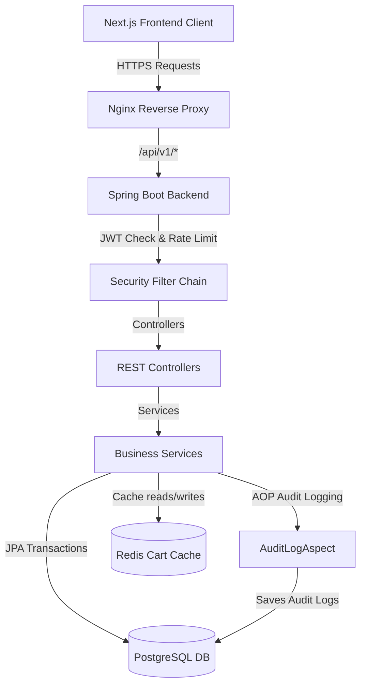
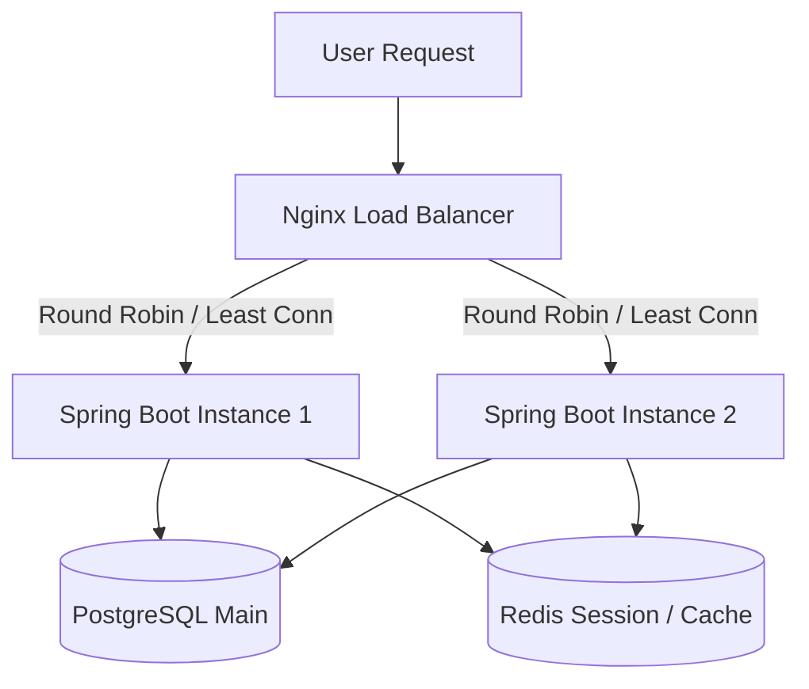

# Tài Liệu Hệ Thống 7Eleven Shop (E-commerce Platform)

Tài liệu này cung cấp cái nhìn toàn diện về kiến trúc hệ thống, hướng dẫn phát triển, cấu hình vận hành và các tiêu chuẩn bảo mật/bảo trì cho dự án **7Eleven Shop**. Đây là cẩm nang kỹ thuật cho cả các lập trình viên (Developers) và kỹ sư vận hành (DevOps/SRE).

---

## 1. Tổng Quan Hệ Thống (System Overview)

### 1.1 Mục Đích & Sứ Mệnh
**7Eleven Shop** là một nền tảng thương mại điện tử (E-commerce) hiện đại, tinh gọn và có hiệu năng cao. Hệ thống được thiết kế theo kiến trúc nguyên khối tách biệt (Decoupled Monolith) với backend cung cấp RESTful APIs bảo mật và frontend Next.js App Router tối ưu trải nghiệm người dùng (UX) và tối ưu hóa SEO.

### 1.2 Các Tính Năng Cốt Lõi
*   **Giao diện Khách hàng (User Web App):**
    *   Xem danh sách sản phẩm, lọc thông minh theo danh mục, khoảng giá, và tìm kiếm từ khóa thời gian thực.
    *   Xem chi tiết sản phẩm, xem album ảnh động dạng Carousel, hiển thị trạng thái tồn kho thực tế.
    *   Giỏ hàng động (dynamic shopping cart) đồng bộ thời gian thực với máy chủ.
    *   Quy trình thanh toán (checkout) nhanh gọn hỗ trợ phương thức COD (Thanh toán khi nhận hàng).
    *   Bảng điều khiển cá nhân (Dashboard) gợi ý sản phẩm phù hợp, hiển thị lịch sử mua hàng và quản lý chi tiết đơn hàng.
*   **Giao diện Quản trị (Admin Panel):**
    *   **Dashboard KPI:** Biểu đồ xu hướng doanh thu và trạng thái đơn hàng (sử dụng thư viện Recharts).
    *   **Quản lý danh mục (Category Management):** CRUD danh mục sản phẩm, có ràng buộc kiểm tra ngăn chặn xóa nếu danh mục đang chứa sản phẩm.
    *   **Quản lý sản phẩm (Product Management):** CRUD sản phẩm, hỗ trợ upload nhiều ảnh cùng lúc lên dịch vụ đám mây Cloudinary, quản lý tồn kho và phiên bản.
    *   **Quản lý đơn hàng (Order Management):** Theo dõi danh sách đơn hàng toàn hệ thống, phê duyệt trạng thái đơn hàng theo máy trạng thái (State Machine).
    *   **Quản lý thành viên (User Management):** Phân quyền vai trò (Role: User / Admin), khóa hoặc kích hoạt tài khoản thành viên để đảm bảo an ninh hệ thống.

### 1.3 Vai Trò Người Dùng (User Roles)
Hệ thống phân chia quyền hạn nghiêm ngặt thông qua cơ chế Role-Based Access Control (RBAC):
1.  **Khách hàng (CUSTOMER):**
    *   Được phép xem sản phẩm, quản lý giỏ hàng cá nhân, đặt hàng và quản lý đơn hàng của chính mình.
    *   Không được phép truy cập vào bất kỳ tài nguyên quản trị nào.
2.  **Quản trị viên (ADMIN):**
    *   Có toàn quyền quản trị hệ thống: CRUD sản phẩm & danh mục, xem doanh thu và KPI của cửa hàng, thay đổi trạng thái đơn hàng, khóa tài khoản người dùng hoặc nâng/hạ quyền người dùng khác.

### 1.4 Công Nghệ Sử Dụng (Tech Stack)
*   **Backend:** Spring Boot 3.2.11, Java 21, Maven.
*   **Database:** PostgreSQL 16 (Hệ cơ sở dữ liệu quan hệ chính), Redis 7 (Lưu trữ và cache giỏ hàng tạm thời).
*   **Frontend:** Next.js 14 (App Router), TypeScript, Tailwind CSS, shadcn/ui.
*   **Bảo mật:** JWT Stateless Auth, mã hóa BCrypt, Rate Limiting với Bucket4j, AOP Audit Logging.
*   **Lưu trữ hình ảnh:** Cloudinary Cloud Storage.
*   **Môi trường & Vận hành:** Docker, Docker Compose, Nginx, GitHub Actions CI/CD.

---

## 2. Kiến Trúc Hệ Thống (System Architecture)

### 2.1 Sơ Đồ Luồng Dữ Liệu & Khối Chức Năng (System Architecture Diagram)



### 2.2 Các Thành Phần Chính của Hệ Thống

#### A. Backend Application (Spring Boot)
Thiết kế theo mô hình phân lớp chuẩn (Layered Architecture):
*   **Controller Layer:** Tiếp nhận các HTTP Request, thực hiện validate dữ liệu đầu vào thông qua Jakarta Validation (`@Valid`, `@NotNull`, `@Min`...) và trả về dữ liệu chuẩn hóa dạng `ApiResponse`.
*   **Service Layer:** Chứa toàn bộ các xử lý nghiệp vụ (Business Logic). Tách biệt giữa Interface và Implementation (`ProductService` & `ProductServiceImpl`) đảm bảo tính trừu tượng và dễ dàng viết Unit Test.
*   **Repository Layer (Spring Data JPA):** Tương tác với PostgreSQL thông qua Hibernate ORM. Sử dụng các câu lệnh truy vấn tối ưu và Native Query khi cần thiết.
*   **Security (Spring Security + JWT):**
    *   Sử dụng bộ lọc custom `JwtAuthenticationFilter` để chặn các request, trích xuất JWT từ header `Authorization: Bearer <token>`, giải mã và nạp thông tin người dùng vào `SecurityContextHolder`.
    *   Cấu hình Stateless Session (`SessionCreationPolicy.STATELESS`) - hoàn toàn không lưu trạng thái phiên làm việc trên server, giúp hệ thống dễ dàng mở rộng theo chiều ngang.

#### B. Frontend Application (Next.js 14 App Router)
*   **App Router (`/src/app`):** Tách biệt các page, layout và quản lý routing theo thư mục.
*   **Zustand Store (`/src/stores`):** Quản lý state gọn nhẹ ở client. `authStore` lưu trữ token và thông tin user hiện tại. `cartStore` đóng vai trò đồng bộ trạng thái giỏ hàng.
*   **React Query (TanStack Query):** Quản lý server-state, tự động cache, re-fetch và invalidation dữ liệu khi có thay đổi (mutation).
*   **Axios Client (`/src/lib/axios.ts`):** Được cấu hình interceptor tự động đính kèm Token JWT vào header và bắt lỗi `401 Unauthorized` để thực hiện logout tự động nếu token hết hạn hoặc tài khoản bị khóa.

#### C. Cơ Sở Dữ Liệu (Databases)
*   **PostgreSQL 16:** Lưu trữ tất cả dữ liệu có tính nhất quán cao (ACID): Users, Roles, Products, Categories, Orders, Order Items, Audit Logs.
*   **Redis 7:** Lưu trữ giỏ hàng dưới dạng cặp Key-Value. Key có dạng `cart:userId` và Value là chuỗi JSON chứa danh sách sản phẩm trong giỏ hàng. Giúp tăng tốc độ truy cập giỏ hàng mà không cần truy vấn vào database PostgreSQL liên tục.

### 2.3 Các Quyết Định Kiến Trúc Quan Trọng (Architectural Decisions)

*   **Stateless JWT Authentication:**
    *   *Mô tả:* Token có thời hạn sử dụng là 7 ngày (`604800` giây), không sử dụng cơ chế Refresh Token hay Session Blacklist để giảm tải tối đa cho máy chủ.
    *   *Lý do:* Đơn giản hóa kiến trúc, giúp server không phải lưu trữ trạng thái đăng nhập, phù hợp cho hệ thống có hàng ngàn request đồng thời.
*   **Optimistic Locking (Khóa Lạc Quan):**
    *   *Mô tả:* Sử dụng annotation `@Version` trong thực thể `Product` tại cột `version`. Mỗi khi sản phẩm được cập nhật (ví dụ: trừ kho hàng khi thanh toán), Hibernate sẽ tự động so sánh số version.
    *   *Lý do:* Ngăn chặn hiện tượng tranh chấp dữ liệu (Race Condition) khi có nhiều khách hàng cùng mua một sản phẩm tại cùng một thời điểm mà số lượng tồn kho chỉ còn lại rất ít.
*   **Audit Logging với AOP (Aspect-Oriented Programming):**
    *   *Mô tả:* Tạo một annotation custom `@Auditable` và khía cạnh `@Aspect` (`AuditLogAspect`). Bất kỳ hành động nghiệp vụ nhạy cảm nào (Login, Register, Create Order, Update Stock, Lock User) đều được ghi nhận tự động vào bảng `audit_logs` bao gồm thông tin: IP, User Agent, Actor ID, chi tiết Payload (đã được tự động lọc và che giấu mật khẩu dưới dạng `[MASKED]`), kết quả (SUCCESS/FAILED) và lỗi nếu có.
    *   *Lý do:* Đảm bảo tính tuân thủ bảo mật, dễ dàng điều tra lỗi và giám sát hành vi của Admin/User mà không cần viết code ghi log lặp đi lặp lại ở các service.
*   **Rate Limiting IP-based (Giới hạn Tần suất Yêu cầu):**
    *   *Mô tả:* Tích hợp thư viện Bucket4j thông qua `RateLimitFilter` ngăn chặn tấn công dò mật khẩu (Brute-force) trên các endpoint `/api/v1/auth/login` và `/api/v1/auth/register`. Mỗi IP chỉ được phép thực hiện tối đa 5 yêu cầu trong vòng 15 phút. Hệ thống tự động bypass bộ lọc này khi chạy unit test.
*   **Tìm Kiếm Bằng pg_trgm (Trigram Indexing):**
    *   *Mô tả:* Kích hoạt extension `pg_trgm` của PostgreSQL và tạo GIN index trên cột `name` của sản phẩm.
    *   *Lý do:* Cho phép tìm kiếm sản phẩm cực nhanh bằng mệnh đề `ILIKE` với độ khớp chuỗi cao mà không cần tích hợp các công cụ cồng kềnh như Elasticsearch trong giai đoạn MVP.
*   **Cơ Chế Soft Delete (Xóa Mềm):**
    *   *Mô tả:* Sử dụng `@SQLDelete` và `@SQLRestriction` trong Hibernate để đánh dấu trường `deleted_at` hoặc trạng thái `deleted = true` thay vì xóa vật lý bản ghi.
    *   *Lý do:* Bảo toàn lịch sử dữ liệu (đặc biệt là đơn hàng và thống kê tài chính), tránh phá vỡ ràng buộc khóa ngoại (Foreign Key) nhưng vẫn đảm bảo client không truy vấn phải sản phẩm đã ẩn.

---

## 3. Hướng Dẫn Cài Đặt & Chạy Môi Trường Development

### 3.1 Yêu Cầu Hệ Thống (Prerequisites)
Trước khi bắt đầu, hãy đảm bảo máy tính của bạn đã cài đặt các công cụ sau:
*   **Java Development Kit (JDK):** Phiên bản 21 (khuyến nghị Eclipse Temurin hoặc OpenJDK).
*   **Node.js:** Phiên bản 20.x trở lên.
*   **Docker & Docker Compose:** Phiên bản mới nhất.
*   **Maven:** Phiên bản 3.9+ (hoặc dùng Maven Wrapper `./mvnw` đính kèm dự án).

### 3.2 Cấu Hình File Môi Trường
1.  Tại thư mục gốc của dự án, sao chép file cấu hình mẫu:
    ```bash
    cp .env.dev.example .env.dev
    ```
2.  Mở file `.env.dev` và chỉnh sửa các giá trị cấu hình tương ứng với môi trường của bạn:
    ```env
    SPRING_PROFILE=dev
    DB_NAME=seven_eleven
    DB_USER=postgres
    DB_PASSWORD=postgres
    DB_PORT=5432
    REDIS_PORT=6379
    REDIS_PASSWORD=seven_eleven_redis_pass_dev
    JWT_SECRET=devsecretkeydevsecretkeydevsecretkeydevsecretkeydevsecretkey
    CLOUDINARY_CLOUD_NAME=ten_cloud_cua_ban
    CLOUDINARY_API_KEY=api_key_cloudinary
    CLOUDINARY_API_SECRET=api_secret_cloudinary
    NEXT_PUBLIC_API_URL=http://localhost:8080/api/v1
    CORS_ALLOWED_ORIGINS=http://localhost:3000,http://103.72.99.211:3000
    ```

### 3.3 Khởi Chạy Database & Redis (Docker Compose)
Để chạy các dịch vụ phụ trợ nhanh chóng, dự án cung cấp script khởi chạy:
*   **Trên Linux/macOS:**
    ```bash
    chmod +x scripts/run-dev.sh
    ./scripts/run-dev.sh
    ```
*   **Trên Windows:**
    Chạy file `scripts/run-dev.bat` hoặc thực thi lệnh sau từ thư mục gốc:
    ```powershell
    docker compose -f docker-compose.dev.yml up -d
    ```
Lệnh này sẽ khởi động hai container:
*   `shop-postgres` lắng nghe tại cổng `5432`.
*   `shop-redis` lắng nghe tại cổng `6379`.

### 3.4 Khởi Chạy Backend (Độc lập)
1.  Di chuyển vào thư mục backend:
    ```bash
    cd backend
    ```
2.  Chạy ứng dụng bằng Maven Spring Boot plugin:
    ```bash
    ./mvnw spring-boot:run
    ```
    *Lưu ý trên Windows:* Dùng `mvnw.cmd spring-boot:run`.
3.  Backend sẽ khởi động tại cổng `8080`. Bạn có thể truy cập kiểm tra trạng thái sức khỏe qua Actuator: [http://localhost:8080/actuator/health](http://localhost:8080/actuator/health).

### 3.5 Khởi Chạy Frontend (Độc lập)
1.  Di chuyển vào thư mục frontend:
    ```bash
    cd frontend
    ```
2.  Cài đặt các gói phụ thuộc (sử dụng `--legacy-peer-deps` để tránh xung đột phiên bản thư viện UI):
    ```bash
    npm install --legacy-peer-deps
    ```
3.  Khởi chạy chế độ Development:
    ```bash
    npm run dev
    ```
4.  Frontend sẽ khởi động tại cổng `3000`. Hãy truy cập [http://localhost:3000](http://localhost:3000) để trải nghiệm ứng dụng.

---

## 4. Cấu Hì Môi Trường Production & Deployment

### 4.1 Danh Sách Biến Môi Trường Quan Trọng

| Tên Biến | Môi Trường | Giá Trị Mặc Định | Mô Tả |
| :--- | :--- | :--- | :--- |
| `SPRING_PROFILES_ACTIVE` | Backend | `prod` | Kích hoạt profile production (`application-prod.yml`) |
| `DB_HOST` | Backend | `postgres-db` | Địa chỉ IP/Domain của PostgreSQL server |
| `DB_PORT` | Backend | `5432` | Cổng kết nối PostgreSQL |
| `DB_NAME` | Cả hai | `seven_eleven_prod` | Tên cơ sở dữ liệu |
| `DB_USER` | Backend | `postgres_prod` | Username kết nối database |
| `DB_PASSWORD` | Backend | *(Bắt buộc thay đổi)* | Mật khẩu kết nối database |
| `REDIS_HOST` | Backend | `redis-cache` | Địa chỉ IP/Domain của Redis server |
| `REDIS_PORT` | Backend | `6379` | Cổng kết nối Redis |
| `REDIS_PASSWORD` | Backend | *(Bắt buộc thay đổi)* | Mật khẩu truy cập Redis |
| `JWT_SECRET` | Backend | *(Bắt buộc, dài >= 32 kí tự)* | Khóa bí mật dùng để ký mã hóa token JWT |
| `CLOUDINARY_CLOUD_NAME`| Backend | *(Bắt buộc)* | Cloud Name từ tài khoản Cloudinary |
| `CLOUDINARY_API_KEY` | Backend | *(Bắt buộc)* | API Key từ Cloudinary |
| `CLOUDINARY_API_SECRET`| Backend | *(Bắt buộc)* | API Secret từ Cloudinary |
| `NEXT_PUBLIC_API_URL` | Frontend | `https://test7eleven.online/api/v1` | URL endpoint API gọi từ client |
| `CORS_ALLOWED_ORIGINS` | Backend | `https://test7eleven.online` | Danh sách tên miền được phép gọi API (CORS) |

### 4.2 Hướng Dẫn Triển Khai VPS Thực Tế (Sử Dụng Docker Compose)

#### Bước 1: Chuẩn bị file `.env.prod` trên VPS
Tạo file `.env.prod` tại thư mục chứa dự án trên VPS với nội dung bảo mật cao:
```env
SPRING_PROFILE=prod
DB_NAME=seven_eleven_prod
DB_USER=postgres_prod
DB_PASSWORD=SecurePassword_123456
DB_PORT=5432
REDIS_PORT=6379
REDIS_PASSWORD=SecureRedisPassword_98765
JWT_SECRET=supersecuretokengeneratorkeywithhighqualityentropyvalue12345!
CLOUDINARY_CLOUD_NAME=my_prod_cloud
CLOUDINARY_API_KEY=8743126985421
CLOUDINARY_API_SECRET=abcdefg_xyz_12345_secret
NEXT_PUBLIC_API_URL=https://test7eleven.online/api/v1
CORS_ALLOWED_ORIGINS=https://test7eleven.online,https://admin.test7eleven.online
```

#### Bước 2: Cấu hình Reverse Proxy Nginx với SSL (Let's Encrypt)
Trên VPS, cấu hình Nginx đóng vai trò SSL Termination và phân phối luồng yêu cầu:
```nginx
# Cấu hình Rate Limiting ở mức Nginx để chống DDoS
limit_req_zone $binary_remote_addr zone=api_limit:10m rate=10r/s;

server {
    listen 80;
    server_name test7eleven.online admin.test7eleven.online;
    return 301 https://$host$request_uri; # Redirect HTTP sang HTTPS
}

server {
    listen 443 ssl http2;
    server_name test7eleven.online;

    ssl_certificate /etc/letsencrypt/live/test7eleven.online/fullchain.pem;
    ssl_certificate_key /etc/letsencrypt/live/test7eleven.online/privkey.pem;

    # Client-side Next.js App
    location / {
        proxy_pass http://localhost:3000;
        proxy_http_version 1.1;
        proxy_set_header Upgrade $http_upgrade;
        proxy_set_header Connection 'upgrade';
        proxy_set_header Host $host;
        proxy_cache_bypass $http_upgrade;
    }

    # API Backend Gateway
    location /api/v1/ {
        limit_req zone=api_limit burst=20 nodelay;
        proxy_pass http://localhost:8080/api/v1/;
        proxy_set_header Host $host;
        proxy_set_header X-Real-IP $remote_addr;
        proxy_set_header X-Forwarded-For $proxy_add_x_forwarded_for;
        proxy_set_header X-Forwarded-Proto $scheme;
    }
}
```

#### Bước 3: Chạy script khởi động Production
Thực thi script khởi chạy môi trường production:
```bash
chmod +x scripts/run-prod.sh
./scripts/run-prod.sh
```
Script này sẽ chạy `docker compose -f docker-compose.yml --env-file .env.prod up --build -d` tự động tải ảnh docker mới nhất từ GitHub Packages (GHCR) và khởi chạy an toàn.

### 4.3 GitHub Actions CI/CD Workflows

Hệ thống được thiết lập tích hợp liên tục (CI) thông qua hai luồng công việc tự động:
1.  **Backend CI (`ci-backend.yml`):**
    *   *Trigger:* Khi có commit push hoặc pull request vào nhánh `main` hoặc `develop` liên quan đến thư mục `backend/**`.
    *   *Các bước:*
        1. Checkout mã nguồn.
        2. Cài đặt JDK 21 (Temurin).
        3. Chạy toàn bộ các Integration Test và Unit Test (`mvn clean test`). Do `CloudinaryConfig` sử dụng `@Profile("!test")`, giai đoạn này sẽ hoạt động độc lập mà không cần credentials Cloudinary thật.
        4. Nếu test vượt qua, thực hiện Build Docker Image sử dụng Dockerfile tối ưu.
        5. Đăng nhập vào GitHub Container Registry (`ghcr.io`).
        6. Đẩy (Push) image lên registry với các tag: `latest` (cho nhánh main) hoặc `develop` kèm mã short-SHA (cho nhánh phát triển).
2.  **Frontend CI (`ci-frontend.yml`):**
    *   *Trigger:* Khi có commit push hoặc pull request liên quan đến thư mục `frontend/**`.
    *   *Các bước:*
        1. Checkout mã nguồn.
        2. Khởi tạo môi trường Node.js 20.
        3. Cài đặt các thư viện (`npm ci`).
        4. Chạy toàn bộ Test Suite và báo cáo tỉ lệ bao phủ (coverage).
        5. Build ứng dụng Next.js tối ưu và đóng gói thành Docker Image.
        6. Đẩy image lên GitHub Packages.

---

## 5. API Documentation

Tất cả các API tuân thủ tiêu chuẩn:
*   **Base Path:** `/api/v1/`
*   **Response Wrapper:**
    ```json
    {
      "data": {},
      "message": "Thông điệp mô tả kết quả xử lý",
      "status": 200
    }
    ```
*   **Phân trang (Pagination):** Tham số truy vấn `?page=0&size=20`. Response dạng phân trang chứa cấu trúc:
    ```json
    {
      "content": [ ... ],
      "totalElements": 100,
      "totalPages": 5,
      "size": 20,
      "number": 0
    }
    ```

### 5.1 Bảng Danh Sách Endpoint RESTful

| Method | Path | Authentication | Quyền Hạn | Mô Tả |
| :--- | :--- | :--- | :--- | :--- |
| **POST** | `/api/v1/auth/register` | Không yêu cầu | Tất cả | Đăng ký tài khoản mới |
| **POST** | `/api/v1/auth/login` | Không yêu cầu | Tất cả | Đăng nhập hệ thống, lấy JWT token |
| **POST** | `/api/v1/auth/logout` | Yêu cầu | Tất cả | Đăng xuất |
| **GET** | `/api/v1/products` | Không yêu cầu | Tất cả | Lọc, tìm kiếm & phân trang sản phẩm |
| **GET** | `/api/v1/products/{id}` | Không yêu cầu | Tất cả | Xem chi tiết sản phẩm |
| **GET** | `/api/v1/categories` | Không yêu cầu | Tất cả | Lấy danh sách danh mục hoạt động |
| **GET** | `/api/v1/cart` | Yêu cầu JWT | Khách hàng | Lấy giỏ hàng hiện tại từ Redis |
| **POST** | `/api/v1/cart/items` | Yêu cầu JWT | Khách hàng | Thêm sản phẩm vào giỏ hàng |
| **PUT** | `/api/v1/cart/items/{productId}`| Yêu cầu JWT | Khách hàng | Cập nhật số lượng sản phẩm trong giỏ|
| **DELETE**| `/api/v1/cart/items/{productId}`| Yêu cầu JWT | Khách hàng | Xóa sản phẩm khỏi giỏ hàng |
| **POST** | `/api/v1/orders` | Yêu cầu JWT | Khách hàng | Tạo đơn hàng mới từ giỏ hàng Redis |
| **GET** | `/api/v1/orders` | Yêu cầu JWT | Khách hàng | Xem danh sách đơn hàng cá nhân |
| **GET** | `/api/v1/orders/{id}` | Yêu cầu JWT | Khách hàng | Xem chi tiết đơn hàng cá nhân |
| **PATCH**| `/api/v1/orders/{id}/cancel` | Yêu cầu JWT | Khách hàng | Hủy đơn hàng (khi ở trạng thái PENDING)|
| **GET** | `/api/v1/admin/dashboard/kpi` | Yêu cầu JWT | Quản trị viên | Thống kê số liệu doanh thu & đơn hàng |
| **GET** | `/api/v1/admin/products` | Yêu cầu JWT | Quản trị viên | Danh sách sản phẩm cho trang quản trị |
| **POST** | `/api/v1/admin/products` | Yêu cầu JWT | Quản trị viên | Tạo mới sản phẩm (Multipart / JSON) |
| **PUT** | `/api/v1/admin/products/{id}` | Yêu cầu JWT | Quản trị viên | Cập nhật thông tin sản phẩm |
| **DELETE**| `/api/v1/admin/products/{id}` | Yêu cầu JWT | Quản trị viên | Xóa mềm sản phẩm |
| **PATCH**| `/api/v1/admin/orders/{id}/status`| Yêu cầu JWT | Quản trị viên | Cập nhật trạng thái đơn hàng |
| **GET** | `/api/v1/admin/users` | Yêu cầu JWT | Quản trị viên | Lọc & tìm kiếm người dùng |
| **PUT** | `/api/v1/admin/users/{id}/lock` | Yêu cầu JWT | Quản trị viên | Khóa tài khoản thành viên |

### 5.2 Chi Tiết Request/Response Các API Quan Trọng

#### 1. Đăng Nhập (`POST /api/v1/auth/login`)
*   **Request Payload:**
    ```json
    {
      "email": "customer@test7eleven.online",
      "password": "mypassword123"
    }
    ```
*   **Response (200 OK):**
    ```json
    {
      "data": {
        "token": "eyJhbGciOiJIUzI1NiJ9.eyJzdWIiOiJjdXN0b21lckB0ZXN0N2VsZXZlbi5vbmxpbmUiLCJpYXQiOjE3MTY1NDYwMDAsImV4cCI6MTcxNzE1MDgwMH0.signature",
        "email": "customer@test7eleven.online",
        "fullName": "Nguyen Van Customer",
        "roles": ["USER"]
      },
      "message": "Login successful",
      "status": 200
    }
    ```

#### 2. Đăng Ký Tài Khoản (`POST /api/v1/auth/register`)
*   **Request Payload:**
    ```json
    {
      "email": "newuser@test7eleven.online",
      "password": "strongpassword123",
      "fullName": "Tran Van New"
    }
    ```
*   **Response (201 Created):**
    ```json
    {
      "data": "User registered successfully",
      "message": "User registered successfully",
      "status": 201
    }
    ```

#### 3. Lấy Giỏ Hàng (`GET /api/v1/cart`)
*   **Headers:** `Authorization: Bearer <JWT_TOKEN>`
*   **Response (200 OK):**
    ```json
    {
      "data": {
        "items": [
          {
            "productId": 10,
            "productName": "Coca Cola 320ml",
            "price": 10000.00,
            "thumbnailUrl": "https://res.cloudinary.com/demo/image/upload/coca.jpg",
            "quantity": 3,
            "subtotal": 30000.00
          }
        ],
        "totalAmount": 30000.00
      },
      "message": "Cart retrieved successfully",
      "status": 200
    }
    ```

#### 4. Thêm Sản Phẩm Vào Giỏ Hàng (`POST /api/v1/cart/items`)
*   **Headers:** `Authorization: Bearer <JWT_TOKEN>`
*   **Request Payload:**
    ```json
    {
      "productId": 10,
      "quantity": 2
    }
    ```
*   **Response (200 OK):**
    ```json
    {
      "data": null,
      "message": "Item added to cart successfully",
      "status": 200
    }
    ```

#### 5. Tạo Đơn Hàng Mới (`POST /api/v1/orders`)
*   **Headers:** `Authorization: Bearer <JWT_TOKEN>`
*   *Mô tả:* Khi gửi request, Backend sẽ tự động lấy thông tin giỏ hàng hiện tại của user từ Redis để làm hóa đơn thanh toán, kiểm tra tồn kho và chuyển đổi thành đơn hàng chính thức.
*   **Request Payload:**
    ```json
    {
      "recipientName": "Nguyen Van A",
      "recipientPhone": "0987654321",
      "deliveryAddress": "123 Đường Lê Lợi, Quận 1, TP. Hồ Chí Minh",
      "note": "Giao giờ hành chính"
    }
    ```
*   **Response (201 Created):**
    ```json
    {
      "data": {
        "id": 152,
        "orderCode": "ORD-1716546059-4592",
        "userId": 2,
        "status": "PENDING",
        "paymentMethod": "COD",
        "paymentStatus": "PENDING",
        "totalAmount": 30000.00,
        "recipientName": "Nguyen Van A",
        "recipientPhone": "0987654321",
        "deliveryAddress": "123 Đường Lê Lợi, Quận 1, TP. Hồ Chí Minh",
        "note": "Giao giờ hành chính",
        "items": [
          {
            "id": 200,
            "productId": 10,
            "productNameSnapshot": "Coca Cola 320ml",
            "priceSnapshot": 10000.00,
            "quantity": 3,
            "subtotal": 30000.00
          }
        ],
        "createdAt": "2026-05-24T21:40:59.123+07:00",
        "updatedAt": "2026-05-24T21:40:59.123+07:00"
      },
      "message": "Order created successfully",
      "status": 201
    }
    ```

#### 6. Thống Kê KPI Cho Admin (`GET /api/v1/admin/dashboard/kpi`)
*   **Headers:** `Authorization: Bearer <ADMIN_JWT_TOKEN>`
*   **Query Params:** `?startDate=2026-05-01T00:00:00Z&endDate=2026-05-31T23:59:59Z`
*   **Response (200 OK):**
    ```json
    {
      "data": {
        "totalRevenue": 45890000.00,
        "totalOrders": 124,
        "totalProducts": 45,
        "totalUsers": 89,
        "orderCountByStatus": {
          "PENDING": 12,
          "CONFIRMED": 5,
          "SHIPPING": 18,
          "DELIVERED": 85,
          "CANCELLED": 4
        }
      },
      "message": "Success",
      "status": 200
    }
    ```

---

## 6. Hướng Dẫn Vận Hành & Bảo Trì (Operations & Maintenance)

### 6.1 Giám Sát Log Hệ Thống (System Monitoring Logs)
Để xem log trực tiếp từ các container đang chạy trong Docker:
*   **Xem toàn bộ logs hệ thống:**
    ```bash
    docker compose logs -f
    ```
*   **Xem chi tiết logs của Backend Spring Boot:**
    ```bash
    docker logs -f shop-backend
    ```
*   **Xem logs của Nginx proxy:**
    ```bash
    docker logs -f shop-nginx
    ```

### 6.2 Dọn Dẹp Bộ Nhớ Cache Redis (Cleaning Redis Cache)
Trong trường hợp thay đổi cấu trúc class DTO lưu trong cache hoặc khi phát hiện lỗi không khớp kiểu dữ liệu (Serialization/Deserialization mismatch), quản trị viên cần xóa cache để làm sạch dữ liệu:
1.  Truy cập vào container Redis:
    ```bash
    docker exec -it shop-redis redis-cli -a "seven_eleven_redis_pass_dev"
    ```
    *(Thay thế mật khẩu tương ứng với biến môi trường `REDIS_PASSWORD` của bạn)*
2.  Xóa toàn bộ các key hiện tại:
    ```redis
    FLUSHALL
    ```
3.  Hoặc chỉ xóa các key giỏ hàng:
    ```redis
    KEYS "cart:*"
    # Sau đó lặp qua và xóa các key trả về bằng lệnh DEL <key>
    ```

### 6.3 Backup & Restore Cơ Sở Dữ Liệu PostgreSQL

#### A. Sao lưu dữ liệu (Backup)
Sử dụng công cụ `pg_dump` để sao lưu an toàn toàn bộ dữ liệu cấu trúc và dữ liệu bảng từ container:
```bash
docker exec -t shop-postgres pg_dumpall -c -U postgres_prod > backup_db_$(date +%F).sql
```
Lệnh trên sẽ tạo ra một file SQL chứa toàn bộ các câu lệnh tạo bảng, chỉ mục (indexes) và chèn dữ liệu mẫu.

#### B. Khôi phục dữ liệu (Restore)
Để khôi phục dữ liệu từ file backup vào container sạch:
```bash
docker exec -i shop-postgres psql -U postgres_prod -d seven_eleven_prod < backup_db_xxxx-xx-xx.sql
```

### 6.4 Điểm Kiểm Tra Sức Khỏe Hệ Thống (Health Check Endpoints)
Spring Boot Actuator được cấu hình để xuất ra thông tin trạng thái hoạt động:
*   **Kiểm tra sức khỏe tổng quát:** [http://localhost:8080/actuator/health](http://localhost:8080/actuator/health)
    *   Trả về trạng thái `"status": "UP"` nếu cơ sở dữ liệu PostgreSQL và cache Redis hoạt động bình thường.
*   **Kiểm tra chi tiết kết nối:**
    Nginx hoặc công cụ giám sát VPS (như Prometheus/Grafana) nên gọi định kỳ endpoint này để gửi cảnh báo tự động khi phát hiện hệ thống gặp sự cố mất kết nối database.

---

## 7. Khắc Phục Sự Cố Thường Gặp (Troubleshooting)

### 7.1 Lỗi `ClassNotFoundException` khi đọc dữ liệu từ Redis
*   **Triệu chứng:** Người dùng truy cập trang giỏ hàng hoặc quản trị viên thao tác nhận thông báo lỗi HTTP 500. Log backend hiển thị lỗi không thể tìm thấy lớp (Class) để chuyển đổi dữ liệu.
*   **Nguyên nhân:** Xảy ra do backend thay đổi cấu trúc package (ví dụ: sau khi di chuyển các lớp DTO/Entity từ dạng phẳng sang cấu trúc Module). Dữ liệu cũ trong Redis được lưu bằng bộ tuần tự hóa mặc định của JDK (`JdkSerializationRedisSerializer`) ghi kèm tên package cũ, dẫn đến việc không thể đọc lại.
*   **Giải pháp xử lý:**
    1.  Xóa sạch Redis volume hoặc chạy lệnh `FLUSHALL` trên Redis CLI.
    2.  Về mặt code, hệ thống đã được cập nhật sang bộ serializer JSON an toàn (`GenericJackson2JsonRedisSerializer`). Điều này giúp dữ liệu lưu dưới dạng JSON thuần túy, không phụ thuộc vào classpath của Java.

### 7.2 Lỗi CI backend chạy thất bại do thiếu Cloudinary Credentials
*   **Triệu chứng:** Pipeline GitHub Actions chạy build test backend gặp lỗi văng Exception không tìm thấy các thuộc tính cấu hình `cloudinary.cloud-name`, `cloudinary.api-key`, `cloudinary.api-secret`.
*   **Nguyên nhân:** Spring Boot cố gắng khởi tạo Bean `Cloudinary` khi chạy ngữ cảnh kiểm thử tích hợp (`@SpringBootTest`). Tuy nhiên, môi trường CI không được cung cấp các biến bí mật này.
*   **Giải pháp xử lý:**
    *   Đảm bảo class `CloudinaryConfig` được gắn annotation `@Profile("!test")`.
    *   Khi chạy test, kích hoạt profile `test` thông qua cài đặt trong `src/test/resources/application-test.yml` hoặc `@ActiveProfiles("test")`. Môi trường này sẽ sử dụng mock của `CloudinaryStorageService` mà không cần khởi tạo Cloudinary Bean thật.

### 7.3 Lỗi không lưu được sản phẩm vào giỏ hàng
*   **Triệu chứng:** Khách hàng bấm thêm vào giỏ hàng, giao diện xoay vòng và báo lỗi, không có sản phẩm nào xuất hiện trong giỏ hàng.
*   **Nguyên nhân:** Kết nối giữa Backend và Redis bị gián đoạn, hoặc cấu hình sai mật khẩu `REDIS_PASSWORD`.
*   **Giải pháp xử lý:**
    1.  Kiểm tra trạng thái container Redis bằng lệnh `docker ps` và xem healthcheck.
    2.  Kiểm tra lại cấu hình file `.env.prod` xem mật khẩu và cổng kết nối của Redis có trùng khớp với cấu hình trong compose hay chưa.

### 7.4 Trang danh sách sản phẩm ở Client bị reset trang liên tục khi chuyển bộ lọc
*   **Triệu chứng:** Người dùng chuyển sang trang 2, sau đó bấm lọc theo danh mục hoặc sắp xếp giá thì trang bị nhảy lung tung hoặc đơ.
*   **Nguyên nhân:** Xung đột trạng thái bất đồng bộ giữa Query String trên thanh địa chỉ URL của trình duyệt và trạng thái cục bộ (local state) của Next.js Client component.
*   **Giải pháp xử lý:**
    *   Sử dụng giải pháp đồng bộ hóa: Chỉ dùng local state `page` để quản lý hiển thị trang hiện tại và cập nhật địa chỉ URL bằng `router.replace` một cách mượt mà.
    *   Thiết lập hàm `useEffect` lắng nghe các sự thay đổi của bộ lọc (khoảng giá, danh mục, từ khóa) để tự động reset trang hiện tại về `page = 1` trước khi kích hoạt API fetch dữ liệu mới.

---

## 8. Hướng Dẫn Mở Rộng Hệ Thống (Phase 2 Roadmap)

Dưới đây là định hướng kiến trúc và các bước triển khai khi hệ thống bước sang giai đoạn mở rộng (Phase 2):

### 8.1 Tích Hợp Cổng Thanh Toán Trực Tuyến VNPay
Để thay thế hoặc bổ sung cho phương thức thanh toán COD, quy trình tích hợp VNPay được thực hiện như sau:
1.  **Backend Integration:**
    *   Thêm enum `PAYMENT_METHOD` mới là `VNPAY`.
    *   Tạo API `/api/v1/orders/vnpay-url` nhận thông tin hóa đơn và tạo URL chuyển hướng thanh toán (Redirect URL) chứa các tham số bảo mật của VNPay (VNP_SecureHash).
    *   Tạo endpoint IPN (Instant Payment Notification) nhận callback ngầm từ VNPay để cập nhật trạng thái thanh toán (`paymentStatus = PAID` hoặc `FAILED`) một cách an toàn và cập nhật tồn kho.
2.  **Frontend Integration:**
    *   Khi thanh toán bằng VNPay, chuyển hướng người dùng đến URL do backend cung cấp.
    *   Tạo trang xử lý kết quả (`/checkout/vnpay-return`) để hiển thị thông báo thành công/thất bại dựa trên tham số phản hồi từ VNPay.

### 8.2 Xử Lý Tác Vụ Bất Đồng Bộ Với Message Broker (RabbitMQ)
Để tránh tắc nghẽn tài nguyên của luồng chính (Main Thread) khi có hàng trăm giao dịch mua hàng xảy ra cùng lúc, cần tách biệt tác vụ gửi email xác nhận đơn hàng hoặc xử lý hóa đơn sang luồng xử lý bất đồng bộ:
1.  **Triển khai RabbitMQ:**
    Thêm service RabbitMQ vào file `docker-compose.yml`.
2.  **Publisher (Backend):**
    Khi đơn hàng được tạo thành công ở `OrderService`, bắn một tin nhắn chứa thông tin đơn hàng vào hàng đợi (Queue) tên là `order.creation.queue`.
3.  **Consumer (Worker Service độc lập):**
    Viết một module Java nhỏ hoặc một ứng dụng Node.js lắng nghe từ `order.creation.queue`. Khi nhận được tin nhắn, module này sẽ thực hiện nhiệm vụ kết nối SMTP server và gửi email hóa đơn chi tiết cho khách hàng. Nếu gửi lỗi, RabbitMQ sẽ hỗ trợ cơ chế thử lại (Retry Policy).

### 8.3 Nâng Cấp Tìm Kiếm Với Elasticsearch
Khi danh mục sản phẩm tăng lên hàng chục ngàn mặt hàng, tìm kiếm bằng `pg_trgm` trên PostgreSQL sẽ bắt đầu chậm lại và không hỗ trợ tìm kiếm ngữ nghĩa (Semantic/Fuzzy search):
1.  **Đồng bộ dữ liệu (Data Sync):**
    Sử dụng công cụ Logstash hoặc viết một Event Listener ở Backend để đồng bộ hóa mỗi khi sản phẩm được Thêm/Sửa/Xóa từ PostgreSQL sang Elasticsearch Index.
2.  **API Tìm kiếm:**
    Backend sẽ gọi sang Elasticsearch Engine thông qua thư viện Spring Data Elasticsearch để thực hiện các truy vấn tìm kiếm nâng cao (như sửa lỗi chính tả, gợi ý sản phẩm liên quan, phân tích ngữ nghĩa) với tốc độ phản hồi dưới 10ms.

### 8.4 Hướng Dẫn Scale-up Hệ Thống Lên Nhiều Instance
Khi lượng truy cập tăng đột biến, 1 instance Spring Boot chạy trên VPS sẽ bị quá tải CPU/RAM. Cần cấu hình chạy song song nhiều instance backend đằng sau Nginx Load Balancer:



1.  **Bảo toàn tính chất Stateless:**
    *   Vì ứng dụng sử dụng stateless JWT và giỏ hàng được lưu tập trung trong Redis chung (`Shared Redis`), các instance backend không lưu bất kỳ trạng thái phiên (session state) nào cục bộ. Do đó, request của người dùng có thể nhảy tới bất kỳ instance nào mà không sợ mất giỏ hàng hay trạng thái đăng nhập.
2.  **Chia sẻ Khóa Lạc Quan (Optimistic Lock):**
    *   PostgreSQL tập trung sẽ chịu trách nhiệm quản lý version sản phẩm. Dù Instance 1 hay Instance 2 thực hiện giao dịch ghi đè tồn kho, PostgreSQL vẫn bảo đảm tính nhất quán dữ liệu nhờ cơ chế `@Version`.
3.  **Rate Limiting Phân Tán (Distributed Rate Limiting):**
    *   Cần chuyển đổi bộ lọc `RateLimitFilter` từ việc lưu trữ trong bộ nhớ cục bộ (`ConcurrentHashMap`) sang sử dụng Redis-backed Token Bucket (như Redis Rate Limiter hoặc thư viện bucket4j-redis-integration). Điều này đảm bảo giới hạn tần suất yêu cầu của khách hàng được áp dụng đồng bộ trên toàn bộ các instance backend, ngăn chặn hành vi vượt rào bảo mật.
